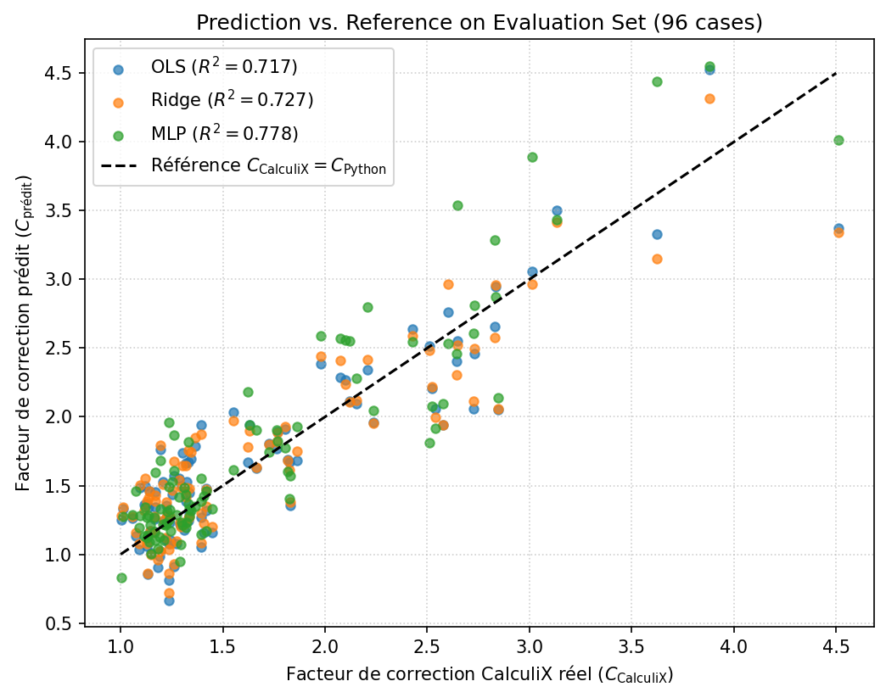
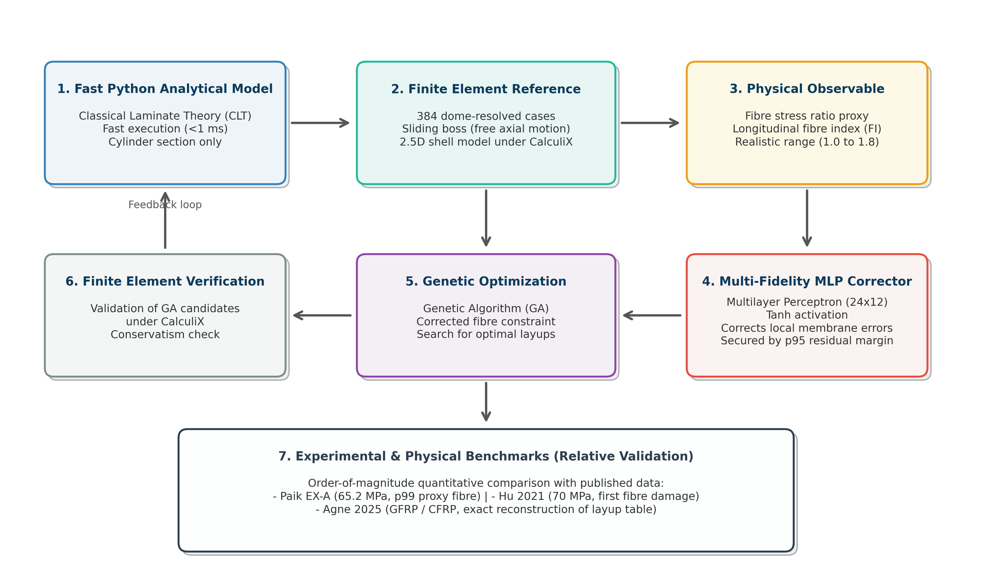

# Multi-Fidelity Correction for Type IV Hydrogen Pressure Vessels

> A statistical corrector recovers the dome-region detail a fast analytical sizing model misses,
> without touching that model's code — MAE 0.102, R² 0.862 (MLP), evaluated against a full
> baseline hierarchy and two distinct extrapolation regimes, not asserted in isolation.



## Problem

Sizing a Type IV composite hydrogen vessel means searching over dome geometry (winding angles,
layer count, boss radius...) inside a genetic-algorithm optimizer, which needs a sizing model fast
enough to call thousands of times. A classical-laminate-theory + membrane-theory model does that in
under 1 ms — but it doesn't resolve the dome in enough detail, so its fiber-stress estimate is wrong
exactly where the vessel usually fails. Re-running a full finite-element model inside every
optimizer iteration is too slow. The fix has to correct the fast model's output without modifying
its source and without becoming the new bottleneck.

## Approach



A 2.5D axisymmetric finite-element reference (CalculiX, geodesic winding law, sliding-boss boundary
condition) resolves the dome on a 384-case design-of-experiments campaign. A small MLP (24×12,
tanh) is trained to correct the fast model's fiber-stress proxy toward that reference, and plugs
into the existing genetic-algorithm optimizer as an external correction layer — the analytical
model's own code is never touched. Optimizer candidates are re-checked against CalculiX, and the
order of magnitude is cross-checked against three published Type IV failure studies.

## Results

Repeated 8-fold cross-validation, mean ± std, against a full baseline hierarchy — not the MLP alone:

| Model | RMSE | MAE | R² |
|---|---:|---:|---:|
| Constant (trivial baseline) | 0.768 ± 0.002 | 0.693 ± 0.004 | −3.910 ± 0.207 |
| OLS | 0.157 ± 0.017 | 0.129 ± 0.013 | 0.791 ± 0.047 |
| Ridge | 0.155 ± 0.016 | 0.127 ± 0.013 | 0.796 ± 0.046 |
| **MLP** | **0.128 ± 0.014** | **0.102 ± 0.011** | **0.862 ± 0.029** |

The MLP beats Ridge, the strongest linear baseline, by 0.066 R² — real, but modest for a
considerably less interpretable model. Worth saying plainly rather than only reporting the top row.

**R² held out on four splits**, including two distinct extrapolation regimes (not one generic "OOD"
bucket): the geometric domain boundary, and an unseen pressure scale.

| Model | Eval (n=96) | Holdout, in-distribution (n=48) | Boundary extrapolation (n=24) | Pressure extrapolation (n=24) |
|---|---:|---:|---:|---:|
| Constant | −4.01 | −5.90 | −2.27 | −4.02 |
| OLS | 0.717 | 0.770 | 0.647 | 0.726 |
| Ridge | 0.727 | 0.787 | 0.672 | 0.703 |
| **MLP** | **0.778** | **0.789** | **0.800** | **0.714** |

The MLP is the only model that doesn't degrade under boundary extrapolation — it's the one split
where it pulls furthest ahead of Ridge (0.800 vs 0.672).

**Data-leakage audit, verified rather than assumed:** 0 duplicate rows, 0 train/eval intersection
(384-case dataset, 288 train / 96 eval / 48 held out OOD / 24 boundary / 24 pressure-scale).

**Cross-checked in order of magnitude** against three published Type IV burst/failure studies (Hu
et al. 2021, Agne et al. 2025, Jin & Paik 2022 — see `reports/references_public.bib`).

## Limitations

- The MLP's edge over Ridge is real but modest (ΔR² = 0.066) for a much less interpretable model —
  worth weighing against Ridge, not just against the trivial baseline, in a production setting.
- Calibrated on one geometry family: single-boss, 11-layer vessels under a geodesic winding law.
  Not tested outside that family.
- The target observable (`fiber_proxy`) is a fiber-stress index chosen to avoid the unstable scales
  of combined-matrix indicators near polar singularities — it does not capture matrix-dominated
  failure modes.
- Validated against simulation data and cross-checked in order of magnitude against literature; no
  physical burst test.
- The genetic-algorithm optimizer this corrector plugs into is an external collaborative codebase
  and is not part of this repository; `code/optimization/ga_correction.py` is kept only as a
  reference for how the correction interfaces with the fitness function.

## Reproduce

The committed outputs — `data/extended_statistical_metrics.json`, the figures above, and the full
write-up (`reports/english/rapport_public_en.pdf`) — are the full result set, not a summary of a
larger private run. Regenerating them:

```bash
pip install numpy pandas matplotlib
python code/calibration/extended_statistical_validation.py
```

This script imports a small internal helper module (`calibration_utils.py`) that resolves dataset
paths and isn't committed to this repository yet — it will not run standalone until that module is
published here. The dataset it reads (`data/fiber_proxy_dataset.csv`) and the metrics it produces
are already in the repository either way.

## References

- Hu, Chen & Pan, "Simulation and Burst Validation of 70 MPa Type IV Hydrogen Storage Vessel with
  Dome Reinforcement," *International Journal of Hydrogen Energy*, 2021.
- Agne et al., "Progressive Failure Modelling of Type IV Composite Overwrapped Pressure Vessels for
  Compressed Natural Gas Storage," *Composite Structures*, 2025.
- Jin, Cheng, Bai & Paik, "Progressive failure analysis and burst mode study of Type IV composite
  vessels," *Ships and Offshore Structures*, 2022.

Full bibliography: [`reports/references_public.bib`](reports/references_public.bib).
