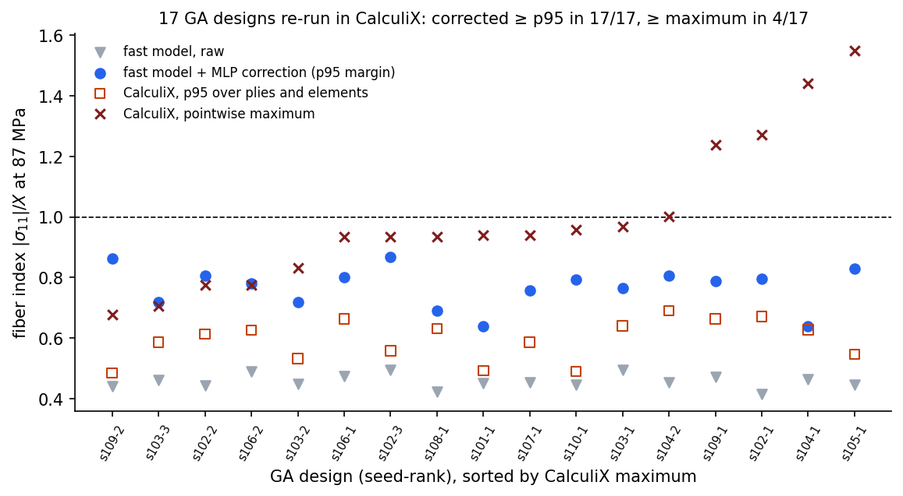
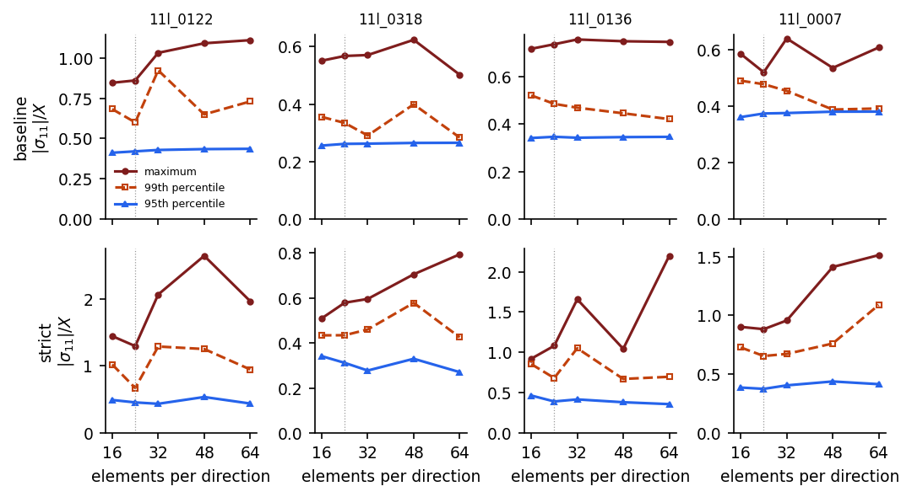

# A learned dome correction for Type IV vessel sizing, and an audit of its high-fidelity target

A Type IV hydrogen tank optimizer used a fast analytical model that only sees the cylinder. I built a CalculiX composite-shell model of the whole vessel, ran it on 384 designs, and trained a small MLP that corrects the fast model's fiber failure index (cross-validated R² 0.862 on log C, against 0.796 for Ridge). Auditing that target with over 220 further CalculiX runs showed that what the MLP learns is mostly a mesh-dependent peak at the polar opening, not a physical dome effect.


*Left: fiber index |σ11|/X, worst ply per element, design `11l_0122` at 70 MPa; the peak is the ring at the polar opening. Right: critical zone over the 384 designs.*

Started as an Arts et Métiers group assignment (May to June 2026); I did all of the modelling, code and analysis myself, and ran the audit in October 2026. The optimizer comes from an existing 2025 codebase: a thick multilayer cylinder model (Lekhnitskii) with Hashin, Tsai-Wu and Puck criteria, evaluated in under a millisecond. It models neither the dome nor the boss. The question was how to make it account for the dome without slowing it down or changing its code.

Full report: [`paper/main.pdf`](paper/main.pdf) (10 pages).

## Results

The MLP predicts C = FI(CalculiX) / FI(fast model) from the design inputs ([`data/extended_statistical_metrics.json`](data/extended_statistical_metrics.json)).

| R² on log C | Ridge | MLP |
|---|---:|---:|
| Repeated 8-fold CV, 288 training designs | 0.796 | 0.862 |
| 96 held-out designs | 0.727 | 0.778 |
| 24 designs at the edge of the geometric domain | 0.672 | 0.800 |
| 24 designs at untrained pressures | 0.703 | 0.714 |


I then ran the optimizer with the corrected model: 10 seeds gave 17 designs, each re-solved in CalculiX at the 87 MPa design burst pressure.



The uncorrected fast index is below the CalculiX 95th percentile for all 17 designs. The corrected index is above it for all 17, by 2 to 78 %, but above the CalculiX maximum for only 4.

## What the audit found

The target uses the maximum of the shell-model fiber index, which sits in the ring of elements at the polar opening in 205 of the 384 designs.

- **The maximum is not mesh-converged.** Four designs were re-solved at 16 to 64 elements per direction. The 95th percentile changes by ≈ 0.4 % between 48 and 64. The maximum does not settle (design 0122: 0.85 at 16×16, 1.11 at 64×64), and the critical ply is a hoop ply at the DOE mesh but a transition ply at 64×64 in all four designs.
- **It depends on a coverage floor.** Below its turnaround radius, every ply keeps 20 to 35 % of its thickness at an angle near 90°, a convention of the code. Removing hoop coverage from the dome raises the peak (0.86 to 1.16) and moves it to a transition ply.
- **In 202 designs no helical ply reaches the polar opening.** The helical turnaround radius R·sin α exceeds the boss radius, and the floor covers the gap. Geodesic winding needs α ≈ arcsin(r_boss/R); only about 50 designs are close.
- **The peak always lands on the left pole.** Clamping no boss at all changes the peak by at most 4 %, so the boundary condition is not the cause; the case generator labels the two polar rings differently.



Re-running the protocol on other targets (paper, Table 4):

| Target | Ridge, held-out R² | MLP, held-out R² |
|---|---:|---:|
| Maximum, original DOE | 0.73 | 0.78 |
| 95th percentile, original DOE (mesh-converged) | 0.27 | 0.48 |
| Maximum, plies stopped at turnaround, 182 designs | 0.21 | −1.25 |
| 95th percentile, same | 0.48 | −0.33 |

The 95th percentile of the shell index is within 10 % of the fast-model maximum for 369 of 384 designs, so little is left to correct there. With plies stopped at their turnaround the target is not mesh-converged either; the MLP overfits and Ridge keeps part of the signal.

## What I built

Everything below is my own work; the optimizer is not ([Credits](#credits)).

- **CalculiX vessel model** ([`generate_calculix_composite_case.py`](code/high_fidelity/generate_calculix_composite_case.py)): S8R composite shells for cylinder, domes and polar openings, Clairaut geodesic winding, one boss fixed axially and one sliding; [`postprocess_calculix_case.py`](code/high_fidelity/postprocess_calculix_case.py) averages stresses per ply in the fiber frame.
- A 384-design DOE at fixed 11 L volume ([`generate_doe_11l.py`](code/config/generate_doe_11l.py)).
- Correctors in NumPy ([`extended_statistical_validation.py`](code/calibration/extended_statistical_validation.py)): constant, OLS, Ridge and a 24×12 tanh MLP with hand-written backprop and Adam.
- Optimizer coupling ([`ga_correction.py`](code/optimization/ga_correction.py)): FI_fast × Ĉ(x) × exp(m₉₅), m₉₅ being the 95th percentile of the MLP's CV residuals.
- Audit campaigns and paper figures ([`code/paper/`](code/paper)), generated from [`data/`](data).


## Limitations

Against six published burst tests, the shell model is 4 to 22 % low on five (Hu 2021, Agne 2025, Jin 2024) and does not reproduce the DLR 2025 test (−74 %, failure near a helical turnaround radius); see [docs/VALIDATION.md](docs/VALIDATION.md). The shells are linear elastic, with no liner, damage or contact. All designs belong to one vessel family. The optimizer is not public, so the GA check cannot be re-run from here.

## Reproduce

```bash
pip install numpy pandas matplotlib
python code/calibration/extended_statistical_validation.py   # about 3 min; metrics JSON and two figures
bash paper/build_paper.sh                                    # paper figures, numbers and PDF (needs latexmk)
```

CalculiX runs use [`code/paper/run_campaign.py`](code/paper/run_campaign.py) with CalculiX 2.23 (set `CCX`): about 2 min per design at 24×24, 11 min at 64×64, with 2 solver threads. Raw `.frd` files are not versioned.

## Corrections

October 2026: the metrics are unchanged; Section 6 of the paper reinterprets them, replacing the earlier reading of the dome peak as a physical, hoop-driven effect.

## Credits

- Genetic-algorithm optimizer and fast analytical model: an existing 2025 codebase, not written by me and not included here.
- [CalculiX](http://www.calculix.de/) 2.23 and ParaView. Published tests are cited in [`paper/references.bib`](paper/references.bib).

Clément Dumeril · [clement.dumeril.net](https://clement.dumeril.net) · [github.com/clementdumeril](https://github.com/clementdumeril)
