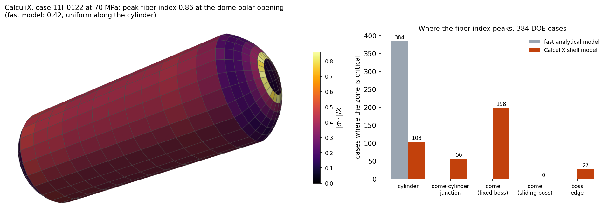

# Correcting a fast pressure-vessel sizing model with 384 CalculiX simulations

A Type IV hydrogen tank optimizer used a fast analytical model that only sees the cylinder. I built a CalculiX composite-shell model of the whole vessel, ran it on 384 designs, and trained a small MLP that corrects the fast model's fiber failure index (cross-validated R² 0.862 on log C, against 0.796 for Ridge).


*Left: fiber index |σ11|/X (worst ply per element) for case `11l_0122` at 70 MPa, rendered from the CalculiX result. The peak sits at the polar opening of the dome on the axially fixed boss, in a hoop ply (see Limitations). Right: critical zone over the 384 cases. The fast model always reports the cylinder.*

Arts et Métiers student project, May to June 2026; the written report was submitted by a group of four, and the modelling, code and analysis in this repository are mine. The starting point was a 2025 genetic-algorithm layup optimizer whose mechanics are a thick multilayer cylinder (Lekhnitskii) with Hashin, Tsai-Wu and Puck criteria, evaluated in under a millisecond. It models neither the dome nor the boss, and burst often starts in the dome. The question was how to make the optimizer account for the dome without slowing it down or changing its code.

Skills: CalculiX (S8R composite shells), NumPy MLP with hand-written backprop/Adam, DOE, repeated k-fold CV, ParaView.

## Results

The MLP predicts the correction factor C = FI(CalculiX) / FI(fast model) from the design inputs. R² is computed on log C ([`data/extended_statistical_metrics.json`](data/extended_statistical_metrics.json)).

| R² on log C | Ridge | MLP |
|---|---:|---:|
| Repeated 8-fold CV, 288 training cases | 0.796 | 0.862 |
| 96 held-out cases | 0.727 | 0.778 |
| 24 cases at the edge of the geometric domain | 0.672 | 0.800 |
| 24 cases at untrained pressures | 0.703 | 0.714 |


I then ran the optimizer with the corrected model. Ten seeds gave 17 distinct designs, and I re-solved each one in CalculiX at the 87 MPa design burst pressure.


Without correction, the fast model underestimates the CalculiX fiber index on all 17 designs. With the correction, it is above the CalculiX 95th percentile on all 17. It is above the pointwise maximum on only 4, and 5 designs have a local peak above 1. So the correction removes the fast model's bias but not the local peaks at the polar opening.

## What I built

The optimizer and fast model come from an existing 2025 codebase that I started from ([Credits](#credits)). Everything below, from the CalculiX model to the corrector and its integration, is my own work.

- **CalculiX vessel model** ([`generate_calculix_composite_case.py`](code/high_fidelity/generate_calculix_composite_case.py)). Cylinder, dome and polar boss are meshed as S8R composite shells. The winding angle follows Clairaut's geodesic law, sin α = r_b / r, and the thickness builds up towards the pole. One boss is fixed axially and the other slides. [`postprocess_calculix_case.py`](code/high_fidelity/postprocess_calculix_case.py) reads the results, averages the stress per ply and rotates it into the fiber frame.
- **Two DOEs.** The first had 128 cases of varying size. The second has 384 cases at a fixed 11 L volume ([`generate_doe_11l.py`](code/config/generate_doe_11l.py)), all solved in CalculiX. Ranges are in [docs/VALIDATION.md](docs/VALIDATION.md).
- **Choice of target.** Near the polar opening, the combined matrix and shear indices reach the hundreds, so I switched to the fiber index. Burst in Type IV vessels is fiber-driven, and C then stays between 1.0 and 4.5.
- **Correctors** ([`extended_statistical_validation.py`](code/calibration/extended_statistical_validation.py)): constant, OLS, Ridge and a 24×12 tanh MLP, all in NumPy.
- **Optimizer coupling** ([`ga_correction.py`](code/optimization/ga_correction.py)). The fitness uses FI_fast × Ĉ(x) × exp(m₉₅), where m₉₅ is the 95th percentile of the MLP's cross-validation residuals. Three optimizer files were changed to call it.

## How it works


The key decision was to correct the fast model from the outside instead of replacing it, because the optimizer calls it tens of thousands of times. The MLP learns one number per design, log C, so the large ratios at the polar opening do not dominate the loss.

The optimizer maximizes the inner-to-outer radius ratio (thinnest wall) and keeps the ply-angle mix near target proportions. Designs whose corrected failure index exceeds 1 at 87 MPa are penalized.

## How I checked it

The MLP was compared with a constant, OLS and Ridge on the same splits. It beats Ridge by 0.066 in CV R², which is modest, and only clearly at the edge of the geometric domain. At untrained pressures OLS is slightly better (0.726). The 96 evaluation cases were never used in training, and re-running the script reproduces the metrics file exactly.

The CalculiX model itself was compared with four published burst tests:

| Test | Gap |
|---|---|
| Hu 2021 (first fiber damage) | 8 % below, but in the cylinder rather than the dome |
| Agne 2025 | 4 to 14 % below |
| Jin 2022 | 10 to 22 % below |
| DLR 2025 (Lueders et al.) | 74 % below, not reproduced |

Details, the mesh study and the contact test are in [docs/VALIDATION.md](docs/VALIDATION.md).

## Limitations

- The shells are linear elastic. The model has no progressive damage, no liner plasticity and no liner/boss contact in the DOE.
- The peak at the polar opening depends on the mesh, which is why the GA check passes at p95 but not at the maximum.
- In 179 of the 198 dome-critical cases the peak is in a hoop ply. The coverage model keeps 20 to 35 % of the hoop thickness, at its ~88° angle, down to the polar opening, which real winding would not. Part of the dome peak may be a modelling artefact.
- The peak lands on the fixed-boss dome in 198 of 384 cases and never on the sliding side, so part of the dome effect comes from the boundary condition.
- All cases belong to one vessel family: 11 L, single boss, geodesic winding, carbon/epoxy.
- The DLR 2025 test is not reproduced, so the absolute fiber index should not be read as a burst prediction.
- The optimizer is not in this repository, so the GA check cannot be re-run from here.

## Reproduce

```bash
pip install numpy pandas matplotlib
python code/calibration/extended_statistical_validation.py   # about 3 min; rewrites the metrics JSON and two figures
python code/plotting/make_readme_figures.py                  # top figure and GA check
```

Re-running CalculiX cases needs CalculiX 2.23 (set `CCX` and `FREECAD_PYTHON` if needed) and the raw `.frd` files, which are not in the repository. Full report: [`rapport_public_en.pdf`](reports/english/rapport_public_en.pdf). [`code/archive/`](code/archive) holds early exploration scripts not used here.

## Credits

- Co-authors of the school report: Ilan Bruski, Elouan Bruneau, William Bueluot.
- Genetic-algorithm optimizer and fast analytical model: an existing 2025 codebase, not written by me and not included here.
- [CalculiX](http://www.calculix.de/) 2.23 and ParaView.
- Published tests: Hu, Chen & Pan, *Int. J. Hydrogen Energy* (2021); Agne et al., *Composite Structures* (2025); Jin, Cheng, Bai, Paik & Li, *Ships and Offshore Structures* (2022); Lueders, Ropte, Schmidt & Liebisch, *Data in Brief* (2025). See [`reports/references_public.bib`](reports/references_public.bib).

Clément Dumeril · [clement.dumeril.net](https://clement.dumeril.net) · [github.com/clementdumeril](https://github.com/clementdumeril)
