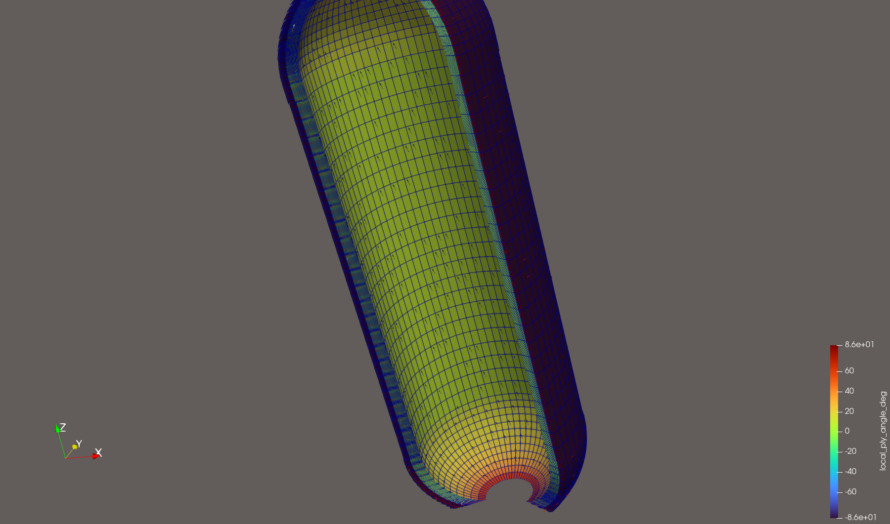
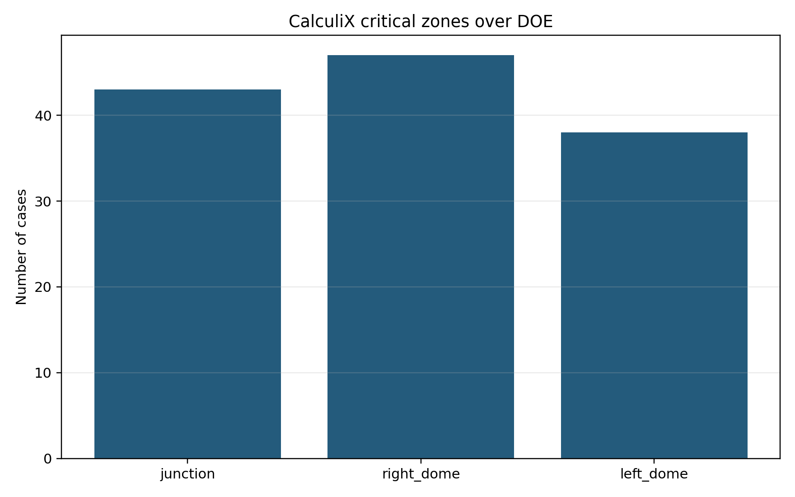
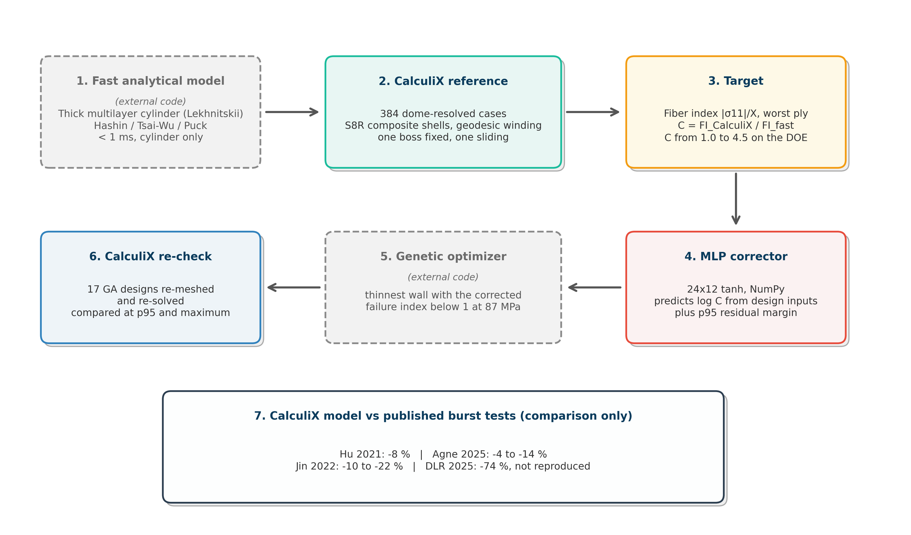
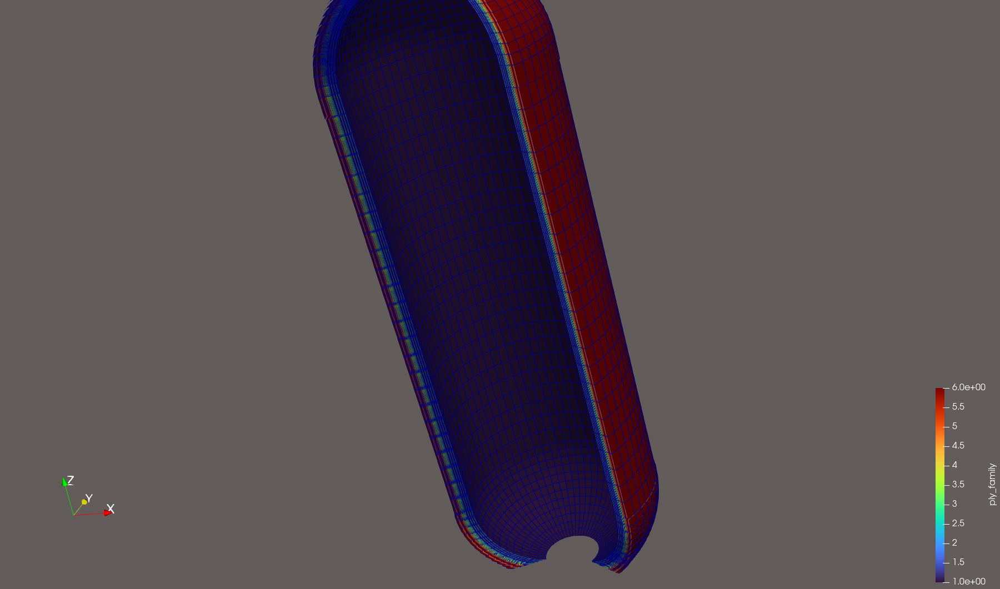
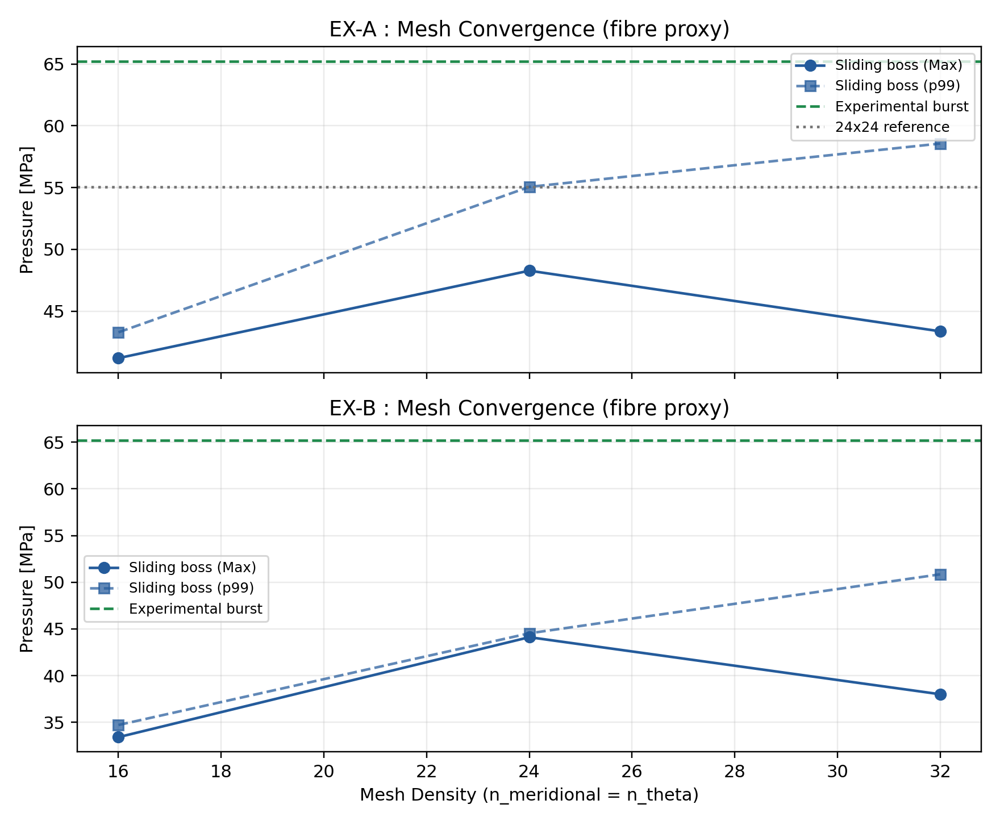
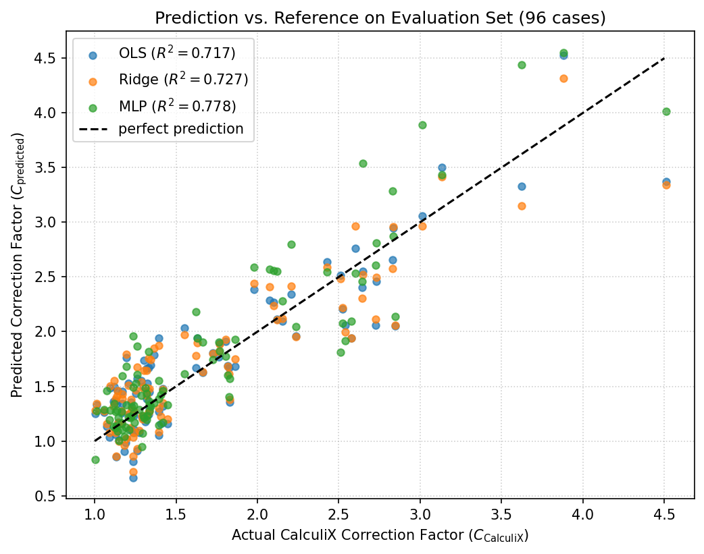

# Multi-Fidelity Structural Optimization of Type IV Hydrogen Pressure Vessels

> A dome-resolved finite-element reference corrects a sub-millisecond analytical sizing model for composite vessel optimization.  
> 384 CalculiX simulations · geodesic composite winding · statistical correction · genetic optimization · FE verification


*Figure 1: Finite-element discretization of a Type IV composite vessel in CalculiX, showing quadratic shell elements (S8R), geodesic winding paths, and local material-frame fiber orientation glyphs across the dome.*

---

## Key Results at a Glance

- **384 dome-resolved FE cases** generated under sliding-boss kinematic boundary conditions (Dataset C).
- **MLP cross-validation $R^2 = 0.862 \pm 0.029$** and **$\text{MAE} = 0.102 \pm 0.011$** across 8-fold repeated cross-validation, improving $R^2$ by 0.066 over Ridge ($0.796 \pm 0.046$).
- **17/17 GA-optimized candidates conservative** relative to the retained CalculiX fiber observable upon full finite-element re-analysis.

> [!NOTE]  
> Conservatism on 17/17 candidates relative to the retained FE observable is an encouraging numerical consistency check in the investigated design space; it does not constitute a physical safety certification or a burst safety guarantee.

---

## Why Dome-Resolved FEA Is Needed

Fast analytical preliminary-sizing codes rely on Classical Laminate Theory (CLT) applied to a thin-walled cylindrical membrane under internal pressure $p$:

$$\sigma_{\theta} = \frac{p\,r}{t}, \qquad \sigma_{z} = \frac{p\,r}{2t}$$

While this calculation evaluates in under 1 ms—making it practical for genetic algorithm (GA) loops requiring tens of thousands of evaluations—it drastically simplifies precisely the regions where structural failure initiates:
- **Domes and polar bosses:** complex meridional curvature variations and polar clearance constraints.
- **Geodesic fiber trajectories:** continuous evolution of ply angle $\alpha(r)$ governed by Clairaut's relation ($\sin\alpha(r) = r_b / r$, with boss radius $r_b$).
- **Thickness redistribution:** significant ply accumulation near the polar openings.
- **Dome-to-cylinder transitions:** localized bending discontinuities and interlaminar shear stresses.


*Figure 2: Distribution of critical failure zones identified across the historical 128-case finite-element campaign.*

This limitation is demonstrated by the historical 128-case Design of Experiments (DOE):
- **Right dome:** 86 cases
- **Left dome:** 22 cases
- **Dome–cylinder junction:** 20 cases
- **Cylinder:** 0 cases

108 out of 128 cases were controlled by a dome region, and none by the cylinder. This is why a cylindrical membrane model alone is insufficient.

---

## Scientific Workflow

Running a full finite-element model inside every optimizer iteration is computationally prohibitive. Conversely, relying solely on an uncorrected membrane model yields non-conservative or suboptimal layups.

The multi-fidelity workflow couples both approaches: the fast analytical model provides baseline evaluations, while an external statistical corrector trained on dome-resolved FE simulations restores fidelity without modifying the analytical code.


*Figure 3: Multi-fidelity engineering workflow. The fast analytical Python model is preserved. CalculiX provides a 384-case dome-resolved reference database, an external statistical corrector learns the discrepancy, the GA optimizes candidate layups, and candidates are re-verified in FEA and cross-checked against published benchmarks.*

1. **Fast analytical baseline:** Evaluates cylindrical membrane stresses and nominal laminate failure via CLT in $<1\text{ ms}$.
2. **Dome-resolved FE reference:** 384 axisymmetric composite shell models solved in CalculiX CrunchiX.
3. **Discrepancy learning:** An external statistical model learns the ratio between the FE reference and the analytical proxy.
4. **Genetic algorithm optimization:** The GA searches the layup space using corrected stress evaluations supplemented with a confidence margin.
5. **FE verification:** Optimal designs are re-meshed and re-analyzed in CalculiX to confirm conservatism.
6. **Literature cross-check:** Order-of-magnitude consistency is checked against published burst benchmarks.

The machine learning model acts strictly as an external discrepancy corrector, preserving the speed of the analytical solver while injecting the spatial fidelity of the FE reference.

---

## Finite-Element Composite Model

The high-fidelity reference is formulated as an axisymmetric composite shell model in CalculiX CrunchiX.


*Figure 4: Cutaway of the composite shell layup showing ply stack stratification and geometric progression from the cylindrical barrel into the dome.*

### Shell Formulation and Winding Trajectory
- **Elements:** Eight-node quadratic shell elements (`S8R`) with reduced integration.
- **Laminate definition:** Element-by-element definition via `*SHELL SECTION, COMPOSITE`, assigning local thickness and ply orientation at each integration point.
- **Winding law:** Geodesic progression satisfying Clairaut's equilibrium $\sin\alpha(r) = r_b / r$ with thickness buildup towards the polar boss.
- **Constitutive behavior:** Linear orthotropic elasticity (`*ELASTIC, TYPE=ENGINEERING CONSTANTS`).

### Sliding-Boss Kinematic Boundary Conditions
The mechanical stress distribution in the dome is highly sensitive to boss boundary conditions:
- The left boss is constrained axially ($U_3 = 0$).
- The right boss is free to translate axially ($U_3$ free) to accommodate natural tank elongation.
- Rigid-body translations are suppressed by transverse pin constraints.

This configuration (`single_boss_reference`) satisfies the longitudinal force equilibrium under internal pressure:

$$F_{\mathrm{axial}} = p\,\pi\,R_i^2 = \sigma_z\,A_{\mathrm{composite}}$$

Locking both bosses axially introduces artificial compressive and shear stresses, whereas the sliding boss correctly reproduces the cylindrical membrane state away from the discontinuities.

### Stress Transformation
For each ply $k$ with fiber angle $\theta_k$, shell stresses in the global frame $\bm{\sigma}^{(k)}$ are mapped into the local material frame:

$$\bm{\sigma}^{(k)}_{\ell} = \bm{T}_{\sigma}(\theta_k)\,\bm{\sigma}^{(k)}\,\bm{T}_{\sigma}^{T}(\theta_k)$$

yielding the longitudinal fiber stress $\sigma_{11}^{(k)}$ used for failure assessment.

---

## Failure Observable

Early project iterations relied on a combined Tsai-Wu failure criterion (`max_combined`). In composite shells, matrix cracking and transverse shear reach failure thresholds at low operating pressures (10–20 MPa) and exhibit extreme numerical values (ratios reaching 100–600) near geometric singularities and boss junctions. Because vessel burst in Type IV tanks is governed by fiber tensile rupture, combined indices obscure the structural limit state.

To provide a well-conditioned reference, the final calibration adopts a pure **fiber-stress failure proxy** ($\mathrm{FI}_{\mathrm{fiber}}$). For ply $j$:

$$\mathrm{FI}_{\mathrm{fiber},j} = \begin{cases} \dfrac{\sigma_{11,j}}{X_T}, & \sigma_{11,j} \geq 0 \\[8pt] \dfrac{-\sigma_{11,j}}{X_C}, & \sigma_{11,j} < 0 \end{cases}$$

The global tank observable is the maximum over all plies:

$$\mathrm{FI}_{\mathrm{fiber}} = \max_j \mathrm{FI}_{\mathrm{fiber},j}$$

Under this formulation, the correction ratio returns to a physically coherent scale ($1.0 \le C_i \le 1.8$).

> [!IMPORTANT]  
> The retained observable is an elastic fiber-dominated failure initiation proxy, not a full progressive-damage burst predictor.

---

## Numerical Robustness: Mesh Sensitivity

Computing the strict pointwise maximum stress at polar boss junctions introduces sensitivity to local geometric singularities (sharp corners, material stiffness mismatches between metal boss and composite).

To examine mesh sensitivity, convergence was analyzed on the Paik EX-A benchmark (experimental burst pressure $65.20\text{ MPa}$) across three grid resolutions: $16\times16$, $24\times24$, and $32\times32$.


*Figure 5: Mesh sensitivity on Paik EX-A. The strict maximum stress oscillates non-monotonically near polar singularities, whereas the p99 spatial quantile provides monotonic, stable behavior.*

- **Strict maximum stress:** Exhibits non-monotonic oscillations due to localized corner singularities:
  - $24\times24$: $48.28\text{ MPa}$
  - $32\times32$: $43.38\text{ MPa}$
- **p99 spatial quantile:** Provides monotonic progression and reduces mesh sensitivity:
  - $16\times16$: $53.40\text{ MPa}$
  - $24\times24$: $55.06\text{ MPa}$
  - $32\times32$: $58.56\text{ MPa}$

Spatial quantile filtering (p95 and p99) is therefore used to filter out localized numerical spikes. An additional refinement level would remain necessary for asymptotic grid independence, as the difference between $24\times24$ and $32\times32$ remains above 6%. Note that p99 acts as a numerical spatial filter and does not represent an empirical probability of structural survival.

---

## Learning the Analytical-to-FE Discrepancy

The statistical corrector models the discrepancy ratio between the CalculiX reference $\mathrm{FI}_i^{\mathrm{FE}}$ and the fast analytical output $\mathrm{FI}_i^{\mathrm{fast}}$:

$$C_i = \frac{\mathrm{FI}_i^{\mathrm{FE}}}{\max(\mathrm{FI}_i^{\mathrm{fast}}, \epsilon)}$$

Four models were trained on Dataset C (384 cases total: 288 train, 48 holdout, 48 out-of-distribution): a constant conservative baseline, Ordinary Least Squares (OLS), Ridge regression ($\alpha = 10.0$), and a Multi-Layer Perceptron (MLP with architecture 24×12 and $\tanh$ activation).


*Figure 6: Predicted vs. reference correction factor on the 96-case evaluation set. The dashed diagonal denotes perfect agreement.*

### Repeated 8-Fold Cross-Validation Performance

| Model | RMSE | MAE | $R^2$ |
|---|---:|---:|---:|
| Constant baseline | $0.768 \pm 0.002$ | $0.693 \pm 0.004$ | $-3.910 \pm 0.207$ |
| OLS | $0.157 \pm 0.017$ | $0.129 \pm 0.013$ | $0.791 \pm 0.047$ |
| Ridge ($\alpha = 10.0$) | $0.155 \pm 0.016$ | $0.127 \pm 0.013$ | $0.796 \pm 0.046$ |
| **MLP (24×12, $\tanh$)** | **$0.128 \pm 0.014$** | **$0.102 \pm 0.011$** | **$0.862 \pm 0.029$** |

The MLP improves cross-validation $R^2$ by 0.066 over Ridge. This gain is real, but modest when considering the trade-off with the transparency and interpretability of linear formulations.

---

## Extrapolation Results

Model robustness was tested across four held-out subsets, distinguishing geometric domain boundary shifts from pressure scale variations:

| Model | Eval ($n=96$) | Holdout, in-distribution ($n=48$) | Boundary extrapolation ($n=24$) | Pressure extrapolation ($n=24$) |
|---|---:|---:|---:|---:|
| Constant | $-4.01$ | $-5.90$ | $-2.27$ | $-4.02$ |
| OLS | $0.717$ | $0.770$ | $0.647$ | $0.726$ |
| Ridge | $0.727$ | $0.787$ | $0.672$ | $0.703$ |
| **MLP** | **$0.778$** | **$0.789$** | **$0.800$** | **$0.714$** |

The MLP demonstrates superior generalization on boundary extrapolation ($R^2 = 0.800$ vs. $0.672$ for Ridge), capturing nonlinear geometric edge effects. Conversely, on pressure extrapolation, OLS performs slightly better than the MLP ($R^2 = 0.726$ vs. $0.714$), as pressure scaling remains largely linear. The MLP should not be characterized as uniformly superior across all out-of-distribution regimes.

---

## Data Leakage Audit

A dataset verification confirms the integrity of the evaluation splits:
- **0 duplicate rows** across the entire 384-case dataset.
- **0 train/eval intersection** between the 288 training cases, 96 evaluation cases, 48 in-distribution holdout cases, 24 boundary extrapolation cases, and 24 pressure extrapolation cases.

---

## End-to-End Optimization Check

The calibrated MLP corrector was coupled to the genetic algorithm optimizer with an added p95 residual margin to penalize non-conservative under-predictions:

- Optimization runs were executed across **10 distinct random seeds**.
- A total of **17 unique candidate designs** were generated.
- Full CalculiX FE models were automatically constructed and solved for all 17 candidates.

All 17 candidates remained conservative relative to the retained CalculiX fiber observable. This verifies the numerical consistency of the coupled pipeline within the investigated search space. However, it does not represent physical burst certification.

---

## What This Project Demonstrates

This project demonstrates a complete, multidisciplinary engineering workflow:
$$\text{Fast Mechanics (CLT)} \longrightarrow \text{Dome-Resolved FEA} \longrightarrow \text{Discrepancy Learning} \longrightarrow \text{GA Optimization} \longrightarrow \text{FE Verification}$$

Rather than attempting to replace mechanics with black-box regression, the methodology uses physics-based simulation to identify where analytical assumptions fail, applies statistical correction to bridge the discrepancy, and closes the loop through numerical verification.

---

## Limitations

- **Linear elastic formulation:** The CalculiX model does not account for thermoplastic liner plasticity or progressive composite damage (delamination, matrix micro-cracking).
- **No physical burst testing:** Results are verified against numerical simulations and cross-checked against literature orders of magnitude; physical hydrostatic burst testing is required for industrial deployment.
- **Single geometry family:** Calibrated specifically for single-boss, 11-layer vessels under geodesic winding paths.
- **Fiber-dominated observable:** The target proxy focuses on fiber failure and does not capture matrix-dominated degradation mechanisms.
- **Local mesh sensitivity:** Pointwise maximum stresses remain sensitive to polar corner singularities.
- **External GA codebase:** The collaborative genetic algorithm framework is external to this repository; `code/optimization/ga_correction.py` is provided as an interface reference.

---

## Reproduce

### Requirements
```bash
pip install numpy pandas matplotlib
```

### Statistical Validation Script
The dataset (`data/fiber_proxy_dataset.csv`) and computed metrics (`data/extended_statistical_metrics.json`) are committed.

```bash
python code/calibration/extended_statistical_validation.py
```

> [!NOTE]  
> The script `code/calibration/extended_statistical_validation.py` imports an internal helper module (`calibration_utils.py`) that resolves local dataset paths and is not yet committed to this repository. Consequently, the script will not run standalone until that utility is published. The benchmark metrics and figure outputs are fully committed.

---

## Full Technical Report

The complete 8-page paper detailing equations, boundary conditions, mesh convergence, and benchmark reconstructions is available in the repository:

- **Compiled PDF:** [`reports/english/rapport_public_en.pdf`](reports/english/rapport_public_en.pdf)
- **LaTeX Source:** [`reports/english/main_public_en.tex`](reports/english/main_public_en.tex)
- **BibTeX Bibliography:** [`reports/references_public.bib`](reports/references_public.bib)

---

## References

1. **Hu, Chen & Pan (2021).** Simulation and burst validation of 70 MPa Type IV hydrogen storage vessel with dome reinforcement. *International Journal of Hydrogen Energy*.
2. **Agne et al. (2025).** Progressive failure modelling of Type IV composite overwrapped pressure vessels for compressed natural gas storage. *Composite Structures*.
3. **Jin, Cheng, Bai & Paik (2022).** Progressive failure analysis and burst mode study of Type IV composite vessels. *Ships and Offshore Structures*.

Complete citations are available in [`reports/references_public.bib`](reports/references_public.bib).

